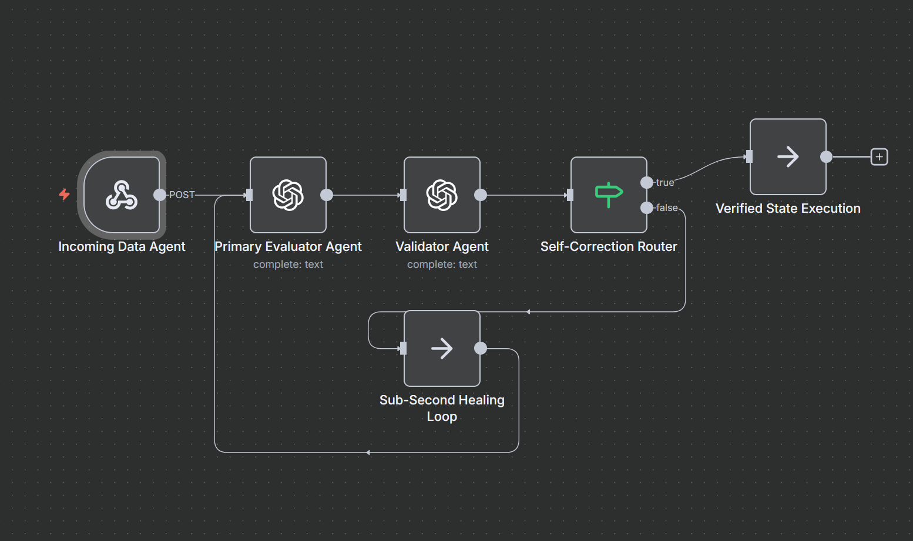

# Multi-Agent Qualification Engine with Self-Correction Loop

## 📌 Project Overview
This project implements a multi-agent framework inside n8n to showcase autonomous decision-making and runtime self-healing. By splitting the operations into separate Primary and Validator roles, the pipeline can detect processing anomalies and resolve its own errors in real-time.

## 🛠️ Technology Stack
- **Orchestration:** n8n State Machine
- **Core AI:** Multi-Agent OpenAI Processing Nodes
- **Architectural Pattern:** Multi-Agent Consensus Loop (Self-Healing)

## ⚙️ Architecture & Logic
1. **Primary Agent Assessment:** Ingests raw stakeholder data and creates a complex qualification matrix.
2. **Validator Agent Audit:** Acts as a runtime code auditor, reviewing the output logic of the primary agent against deterministic parameters.
3. **Sub-Second Self-Correction:** If the validator finds anomalies, it routes the payload backward through a self-healing loop with precise error context, forcing automated sub-second corrections before database commits.
